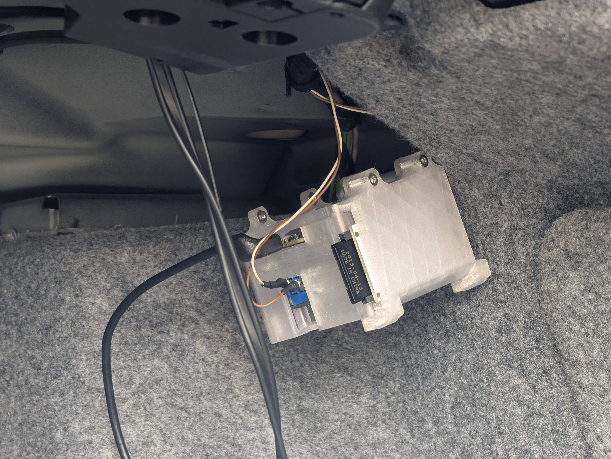
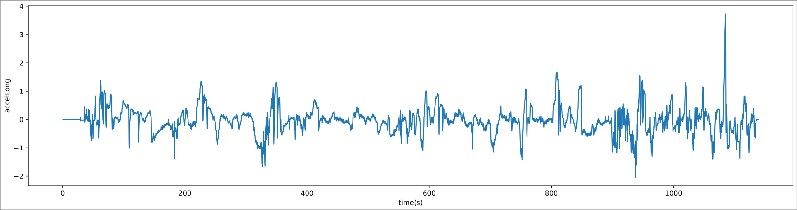
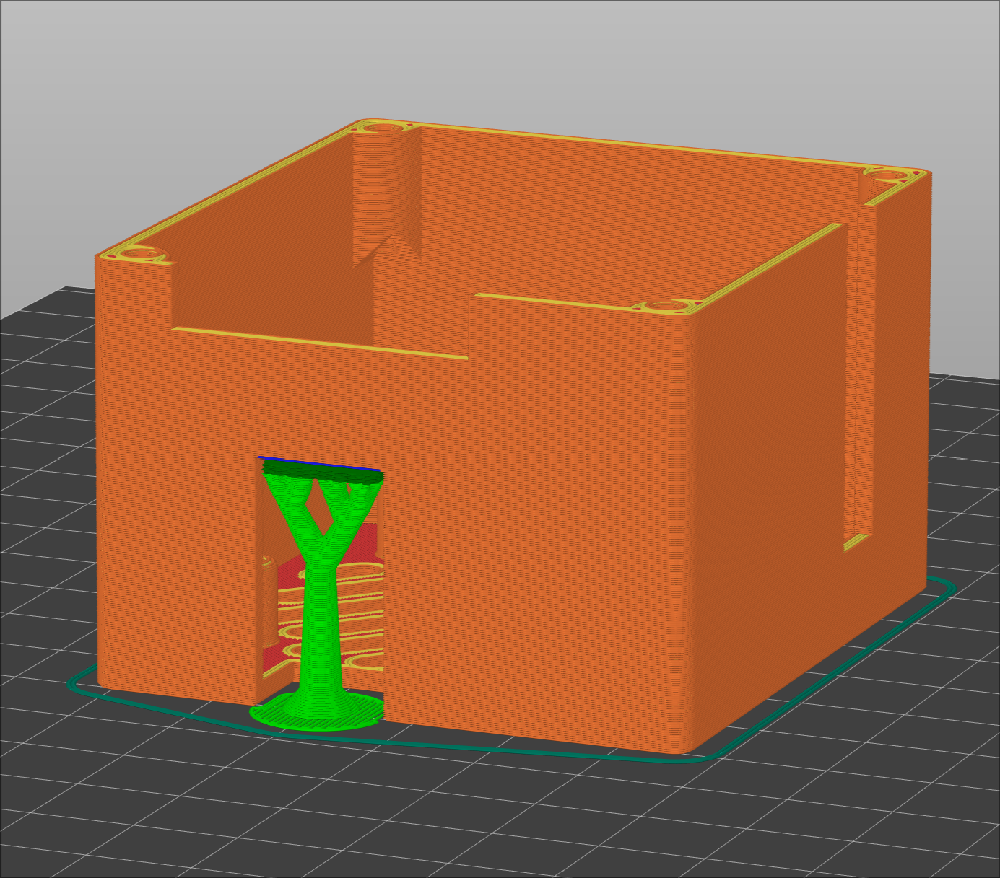

# E92dashModEnder3Screen
Chaotic name, simple mission.  
I have the old LCD from my Creality Ender 3 Pro, which I don't need anymore, because I'm running it headless with Klipper and I want to use it to display some additional information on the dash of my BMW E92.  
Additionally the project comes with an optional/modular data logger addon, to record the sniffed telemetry data.  

The project should be compatible with all cars from the E9x series, but I only have access to an E92, which is why I named the repository like that.  

This is the sender/logging module mounted in the trunk of my E92.  
  
It's responsible for sniffing the CAN-messages and converting them into numbers.  
The data is then sent via ESP-NOW to a receiver unit with the LCD.  
The sender module is also responsible for logging the data if wished.  

Here is some logged sample data.  
The x-axis represents the time in seconds from when the drive started and the y-axis is longitudinal acceleration in m/s².
  

## !!!Disclaimer!!!
Modifying the electrical system of your car can be **dangerous** and may void your warranty!  
Dangerous not only for your car, but also for your health!  
Before attempting any of the described modifications in this repository, **fully** read and **fully** understand everything in this README.  
I do **not** take responsibility for any type of damages, that may occur as a result of the modifications shown here.  
Do this at your own risk.

## Plan
The plan is to tap into the CAN-bus somewhere on the vehicle to gather interesting information.  
From my research it seems the best bus to tap into is the KCAN (Karosserie-CAN = Body-CAN), because it contains the most interesting information.  
The speed of the bus is 100 kbit/s and it can be recognized by its twisted pair of orange/green and green wires, where OR/GN stands for CAN-HIGH and GN for CAN-LOW.  

On my vehicle the easiest place to tap into KCAN seems to be by the rear PDC (park distance control) module.  
This module might not be installed on your car.  
Alternatives include the iDrive and ultrasonic overhead alarm sensor, which are both not installed nor pre-wired on my car.  
The only problem with the PDC is that it is mounted in the trunk of the car and I want the information on the dash of my car... (see below)  
But at least for testing it seems to be the most promising and safest location to me.  
Again, this may vary depending on the options installed in your car.  

**Update:** To solve the problem with the ESP in the trunk and display in the front, I have come to the conclusion that it is probably best to deviate from the originally planned all-in-one solution.  
I am now sure that I want to have an ESP32 in the trunk of the car attached to the KCAN to collect data.  
Then I want another ESP32 with the LCD on the dash of the car.  
Communication between them is handled via ESP-NOW.  
This solution avoids having to run long wires through the car or having to tap into the KCAN in places where I'm not comfortable.  
Another advantage is that this allows us to expand the network of devices in the car pretty easily.  
From my testing during development, this approach has been very reliable and also responsive. I have also found similar projects using ESP-NOW, which seems to support my findings.  

#### Relevant information from KCAN
| CAN-ID | Description | Successful? |
|---|---|---|
| 0x0A8 | Engine torque to compute power, brake and clutch status | **Yes** |
| 0x0AA | Throttle position, engine RPM | **Yes** |
| 0x0C8 | Steering wheel angle/position | **Yes** |
| 0x0CE | Wheel speeds | **Yes** |
| 0x1A0 | Vehicle speed, acceleration | **Yes** |
| 0x1C2 | PDC (park distance control) sensors | **Yes** |
| 0x1D0 | Engine-temperature, (intake) air pressure | **Yes** |
| 0x1D6 | Steering wheel buttons, as not all of them do something in my car | **Yes**, except for disk button (not a top priority though) |
| 0x2F8 | Time and date information | **Yes** |
| 0x330 | Range | **Yes** |
| 0x349 | Fuel level sensors (car has two) | **Yes** |
| 0x362 | Average fuel consumption, avg. speed | **Yes** |
| 0x3B4 | Battery voltage | **Yes** |

## Execution of the plan
Tapping into the KCAN in the trunk of the car was successful.  
I have received all of the expected IDs and the data seems to be accurate/converted properly, which I still have to verify in more detail.  
**Tip:** If you are attempting the same procedure as me, remove the trim panels in the battery area, not only the battery cover.  
I did not and it was *very* tedious due to the space constraints (2 hours for splicing 2 wires).  
**ALSO: Keep away from the black/yellow twisted pair cables going to the battery. They are there for disconnecting the battery in an emergency and should not be messed with!**

At the moment I get the power for the ESP32 with the MCP from the 12V connector in the trunk.  
This connector is on when the ignition is on.  
This is a very convenient solution, but not perfect.  
Because of the (optional) logging system it would be an advantage if the ESP could stay on for a bit after the car is turned off to close the log file.  
Additionally I would like to display a summary of the drive after the car is turned off.  
I know that there are power lines in the BMW that stay on for a while after the car is locked, but I couldn't find much information about this.  
But for now, losing at max a few seconds at the end of the log is fine.  
An alternative would be a small battery backup that keeps the ESP alive for a moment after the car is stopped.  
I'm not a fan of an actual battery, but capacitors might do the trick(?).  

**Attention:** When I first tried to access the KCAN the car was throwing **all** sorts of error messages at me.  
I assume that the cause for this was, that the ESP was sending acknowledgement messages to the car when a message was received.  
Seemingly the car does not like this **at all**. Setting the MCP mode to listen-only seems to fix this though.

## Schematic
The KiCAD schematic in this repository serves a purely symbolic purpose!  
I am not an expert at designing circuits and just want to give you a general idea about the correct wiring.  
Any constructive input on how to improve the schematic is greatly appreciated!

## 3D Models
3D-printable enclosures and accessories can be found [here](cad/exports).  
(Yes, most slicers are able to use .step files, most people are not aware of this).  
All of the models are in their perfect printing orientation and do not *need* supports.  
The only place where you might need a tiny bit of support is [this](cad/exports/SenderModels/Enclosure_bottom.step) model, on the small, straight overhang for the screw terminal.  



## Logging
As mentioned above, the project offers optional logging capability.  
Data is stored to a SD-card in .csv format. For space reasons non-floating-point values in HEX, so not really human readable or ready to easily plot.  
The project offers a C++ program to convert the data back into decimal form, which is located [here](logging).  

*Usage:*  
```
# first compile the program (only needed once)
g++ dataConverter.cpp -o dataConverter

# then convert your log
./dataConverter [your_log.csv]
```

Then you can plot the converted data into a PDF with the python script in the same folder.  
The x-axis will always be the time in seconds since the drive started.  

*Usage:*
```
# index: 0 -> time(s), 1 -> clutchPressed, 2-> brakePressed, ...
python dataPlotter.py [your_log_converted.csv] [column index to plot on y]

# or to plot all columns and export them into separate files
python dataPlotter.py [your_log_converted.csv] all
```

## Hardware
Here you can find a list of materials needed for the project.  
Note that this list always reflects the current state of the project and might change over time.  
Also note that links to products are only meant as a guide what to look for and what/where ***I*** bought them.  
Depending on your location/preference there might be better/cheaper alternatives.  
You can buy the components wherever you want as long as they are the same/similar enough.  
I am in no way affiliated with the linked sellers and can in no way guarantee their reliability!  

| Description | Quantity | Notes | Link |
|---|---|---|---|
| ESP32-WROOM-32 dev module | 2 | most other ESPs should also work, just connect everything to the right GPIOs | https://www.az-delivery.de/en/products/esp32-developmentboard?_pos=1&_psq=esp32+n&_ss=e&_v=1.0 |
| MCP2515 CAN bus module | 1 | yes, odd choice in combination with ESP32, I just use what I already had | https://www.az-delivery.de/en/products/mcp2515-can-bus-modul?_pos=1&_psq=MCP2515&_ss=e&_v=1.0 |
| Ender 3 (Pro) LCD | 1 | also an odd choice but, again, I already had one from my 3D printer; I will not leave a link where to buy one as this doesn't make much sense, it would be easier/cheaper to just implement support for other types of displays, which is also planned for the future! | |
| (SD card module) | (1) | OPTIONAL: this is an optional feature to log the collected telemetry, this can also be added later and doesn't need a code update | https://www.velleman.eu/products/view/sd-card-logging-shield-for-arduino-2-pcs-vma304/?id=435522&lang=en (I have exactly these, didn't buy them there though) |
| (SD card) | (1) | if you want to use the optional data logger you will need an SD card |  |
| (WS2812 LED ring 8 pixels) | (1) | OPTIONAL: used to light up the encoder knob on the LCD and play animations | https://www.az-delivery.de/en/products/led-ring-ws2812-5050-rgb?variant=44246024978699 |
| 10k Ohm resistor | 3 | used as pullups, similar values may also work |  |
| 560 Ohm resistor | 2 | used for the transistors, similar values may also work |  |
| (330 Ohm resistor) | 1 | used for the optional LED ring, similar values also work |  |
| BC547 transistor | 1 | used to switch LCD on/off, can be replaced by a similar NPN |  |
| S8550 transistor | 1 | used to switch LCD on/off, can be replaced by a similar PNP |  |
| M3x6 bolts | 0-4 | Depending on config: used to mount the trim hook, SD card cover on the bottom |  |
| M3x8 bolts | 4-7 | Depending on config: used for the SD card breakout board, mounting the MCP |  |
| M3x10 bolts | 0-2 | Depending on config: used to hold SD card cover |  |
| M3x12 bolts | 4-5 | Used for attaching the sender lid and the optional LED ring cover/holder |  |
| M3 hex nuts | 0-9 | Depending on config: used for the SD card breakout board, accessory mounting |  |
| (Jumper) wires | 1 metric ton | jumper wires for testing on a bread board |  |
| Perf board + accessories |  | for the final implementation in the enclosures in the car | https://www.amazon.com/Smraza-Soldering-Electronic-Compatible-Prototype/dp/B07NM68FXK/ref=sr_1_3 (I bought something similar) | 

## References
Here you can find some links with useful information in relation to this project.  

**CAN bus related**
| Description | Link |
|---|---|
| This thread contains **A LOT** of information about the E9x KCAN, but it is also kind of all over the place so you have to dig a bit | https://www.e90post.com/forums/showthread.php?t=177272 |
| Awesome work on decoding the BMW K-CAN bus system. But watch out, this work wasn't done on an E9X so CAN IDs and formulas *may* differ but should largely be the same. | https://www.loopybunny.co.uk/CarPC/k_can.html |
| Another project decoding the BMW CAN bus, although it says PT-CAN I found a lot of overlap between the K- and PT-CAN | https://github.com/HeinrichG-V12/E65_ReverseEngineering |
| A table I found with CAN bus IDs of the E9X and their meanings | https://github.com/kmalinich/node-bmw-ref/blob/master/canbus/e90-tool32-ids.csv |

**Hardware related**
| Description | Link |
|---|---|
| My source for the Ender3 LCD pinout | https://github.com/rfblock/ender3-lcd-arduino |
| Library used to drive LCD (can be downloaded via Arduino IDE) | https://github.com/olikraus/u8g2 |
| Library used to drive MCP2515 module (can be downloaded via Arduino IDE) | https://github.com/Seeed-Studio/Seeed_Arduino_CAN |
| Library used to drive the LED ring (can be downloaded via Arduino IDE) | https://github.com/adafruit/Adafruit_NeoPixel |
